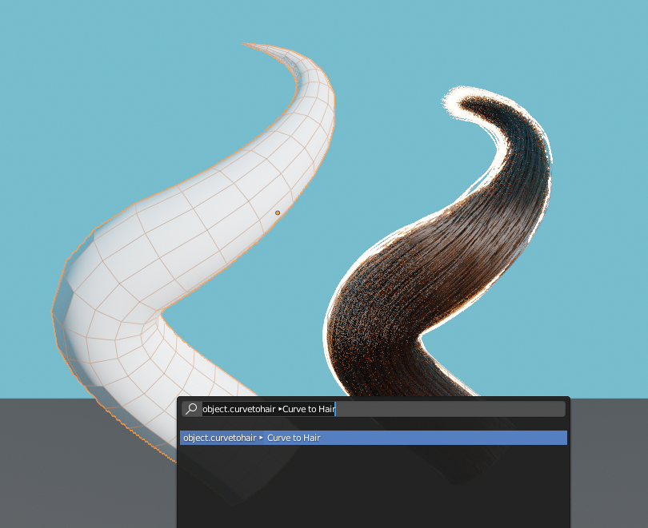

# Blender-Curve-to-Hair
A macro operator that creates particle hairs from beveled Bézier curves

- Shift select and convert several hairs at once
- Edit the hair shape by editing the curve
- Supports both NURBS and Bézier curves with 'Round' and 'Object' bevel types

Object > Convert > Curve to Hair 

### ⚠️ ISSUES ⚠️ ###
- Hair systems are driven by an isolated curve-guide field and follow the shape of the curve. You cannot groom them like regular hair systems
- The hair emitter will not follow the first spline point if you move it. If you want to change where the curve 'starts,' you'll need to move the whole curve as an object
- Hairs don't perfectly follow curves with lots of twisting
- The operator flips the tilt of curves. This is done because hairs twist in the opposite direction of curve tilt
- Does not support curves with the 'Profile' bevel type

### TODO ###
- [ ] Automatically set hair steps based on curve length
- [ ] Copy curve material to hairs
- [ ] Create operator settings panel
- [ ] Move emitter with first spline point when you edit the curve
- [ ] Fix issues with hairs and curve twist

