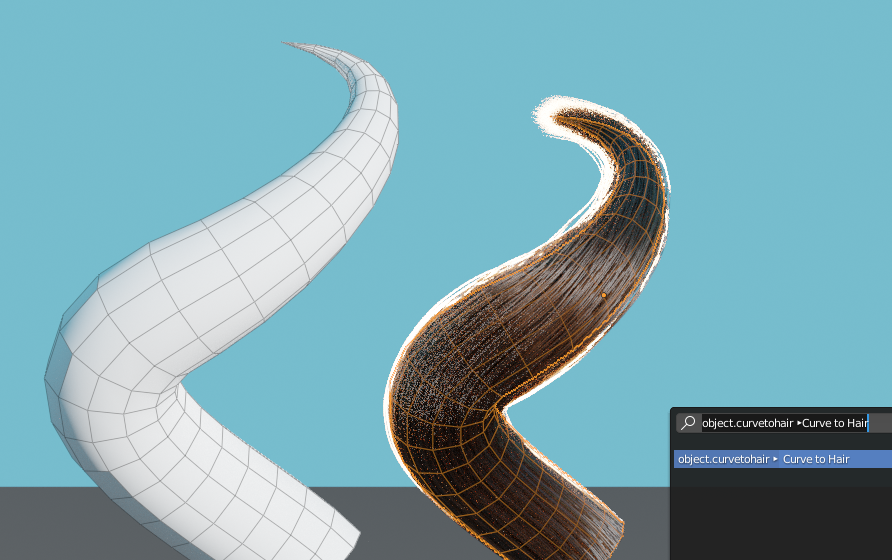

# Blender-Curve-to-Hair
Blender macro to create particle hairs from beveled Bézier curves

⚠️ You must run the script before using the macro. The macro is named 'Curve to Hair'

⚠️ Only supports bezier curves with round bevels for now. Support for NURBS curves and object bevels soon™

⚠️ Hair emitter will not follow the first curve point if you edit the curve

